# console_app.cshap

1. Simple creature
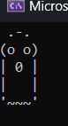

2. Holmes creature

3. Temperature
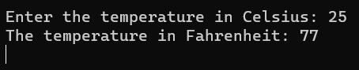

4. Average grade
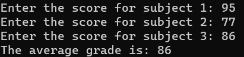

5. Convertion
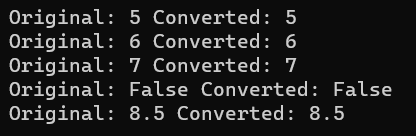

6. Task Increment
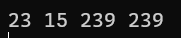

7. Arithmetic Task
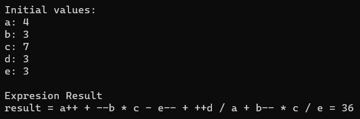

8. Arithmetic Operators
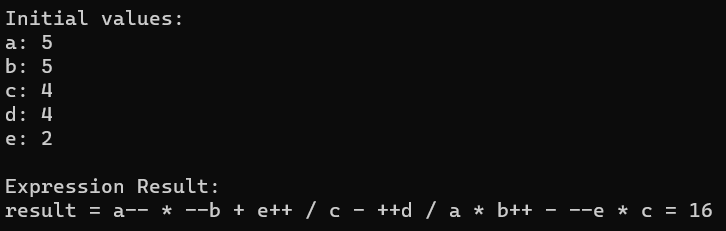

9. Condition if-else
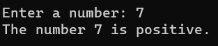

10. Condition switch case
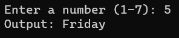

11. Calculators
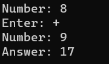

12. Ternary Operators
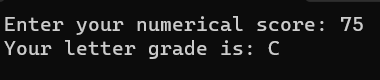

13. Factorial Loop
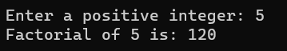