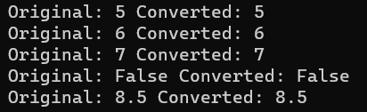

# console_app.cshap

1. Simple creature

2. Holmes creature

3. Temperature

4. Average grade

5. Convertion

6. Task Increment

7. Arithmetic Task

8. Arithmetic Operators

9. Condition if-else

10. Condition switch case

11. Calculators

12. Ternary Operators

13. Factorial Loop
